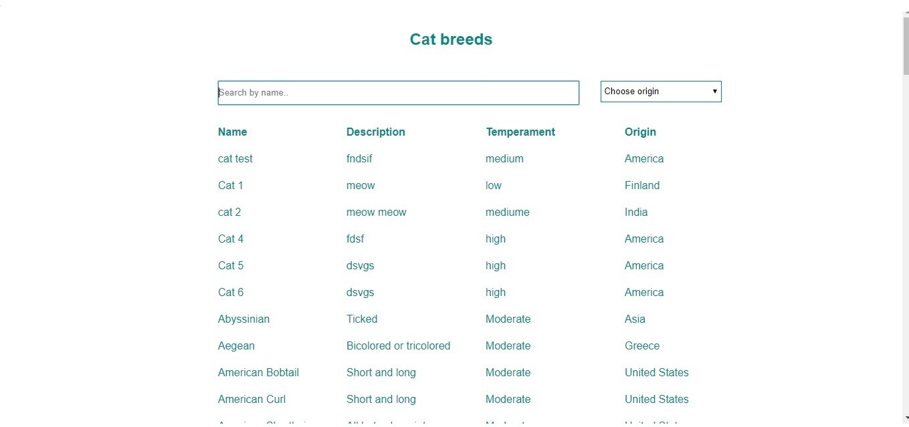
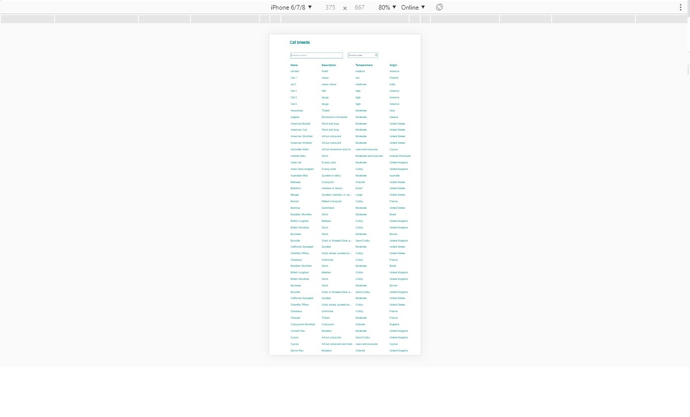

This project was bootstrapped with [Create React App](https://github.com/facebook/create-react-app).

# React cat breeds application

This is a very simple cat breeds application developed with React.js. The application can be accessed from localhost at PORT 3000.





# Get started

1. Install [Node.js](https://nodejs.org/en/download/current/).

2. Install dependencies and start the server.
    Run this command from command prompt to install the needed packages and start the server.
    ```
    $ npm install && npm run start
    ```

# Testing the application

   Open the url http://localhost:3000 if it is not started already.
   Note: server has be to be started already before running this application.

   Cat breed list should be displayed with searchbox and combobox to be able to filter by name and region.

# Understanding the repository structure

* `Breeds.js` is React component that is rendered when application started.
* `Breeds.css` holds the styles for Breeds component.

# Questions

Questions at any phase, please send email to pavani.vaka@gmail.com

